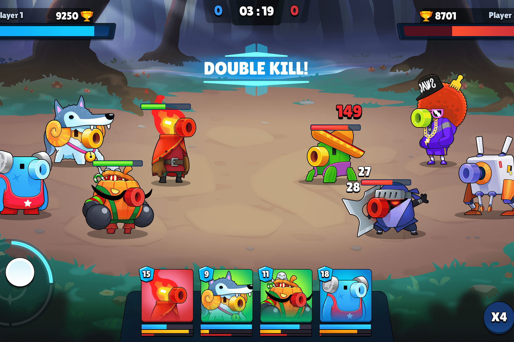

# War of Robots

War of Robots - 2021 年最具吸引力的回合制 NFT 游戏，让你摆脱困境！
War of Robots NFT 游戏不仅仅是一款 Play for Fun 或 Play to Earn 的游戏，它为团队玩家创造了竞争，并要求他们通过与其他玩家的互动和联系来表达战略思维和力量。
机器人战争基于BSC平台开发，使用Cocos2D引擎，优化、轻巧、流畅。
War of Robots 对游戏模式和坦克制作的变体充满信心，这导致玩家可以超越游戏设定的假设限制或环境。玩家可以通过不同的游戏模式：PVE、PVP、联盟战争和锦标赛，在坦克大战宇宙中彰显自己并获得宝贵的奖励。
除了有趣的游戏模式和作为 NFT 元游戏之外，不可否认的是，《机器人之战》的醒目和用户友好的图形将极大地提升玩家的体验。

