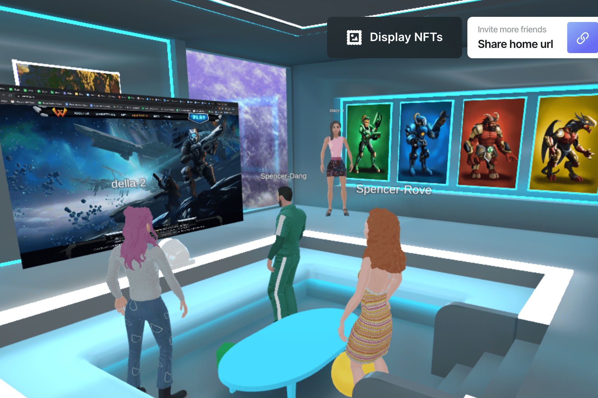

# Warena

什么是 EMPORIA：WARENA METAVERSE？
下一代游戏：游戏元界平台
‌
Warena 的愿景是创造一款有趣且引人入胜的游戏，并使用已开发的 Metaverse 为玩家提供过多的选择，让他们选择如何、在哪里、做什么以及如何玩。我们坚信，玩赚钱游戏不仅是一项很好的投资，而且玩起来也很有趣。我们在 Warena 的重点是如何平衡这两个因素，同时开发一款能够首先为用户和社区服务的游戏。
‌
Warena 的 Emporia 是一个去中心化的元宇宙。该游戏是一个跨链的赚钱沙盒游戏，具有基于令人惊叹的后世界末日科幻世界的各种角色驱动的 NFT，具有可购买的土地、DEX 和由社区驱动的开放市场。在 Warena 中，玩家可以在各种迷你游戏和游戏内活动中使用他们的游戏内资产进行游戏、体验和赚钱。
‌
Warena 旨在成为一个真正的用户拥有的游戏，在数字元世界中拥有自己的去中心化元世界。 Warena 计划通过更多可定制的玩家选项来进一步开发游戏和社区，包括与其他基于 NFT 的游戏（Axie Infinity、Illuvium）的跨元宇宙游戏以及个性化的 NFT 角色。随着 Warena 的发展，玩家将通过去中心化自治组织 (DAO) 体验民主治理模式。

