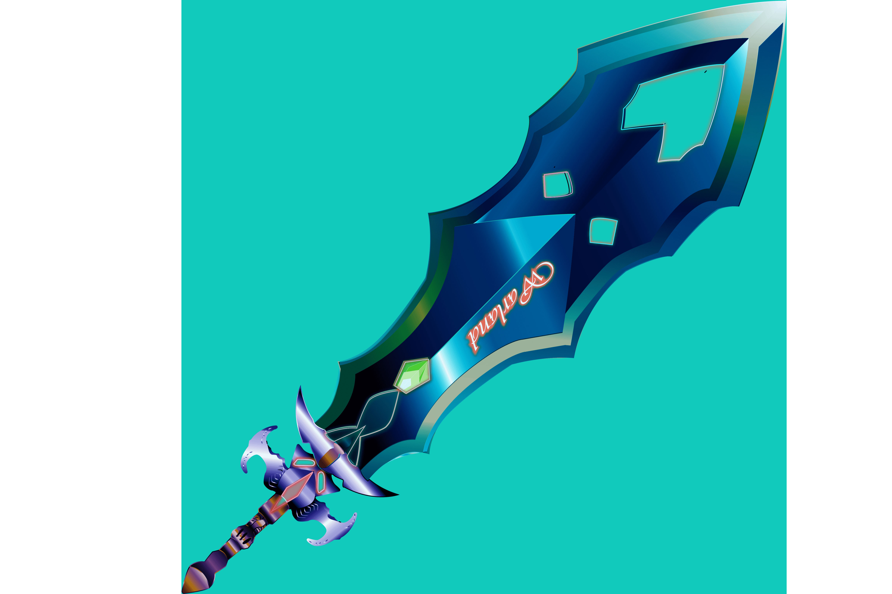

# WarLand

大型多人在线角色扮演游戏 | NFT | 600把独特的剑|索拉纳 |质押 |元界俱乐部|道 |赌场 |战争令牌
WarLand 是具有 NFT 集成的下一级 MMORPG 游戏。
专注并努力开发最佳的游戏环境体验、不同的战斗模式、实用程序和资源。
我们的收藏有 600 把独特的剑，它们是在 Solana 区块链上制作的。诸如 WarLand 游戏的免费会员资格、质押和进入 metaverse 俱乐部之类的东西也可以使用，但仅限于持有者。

Warlands 游戏的元宇宙结合了 5vs5 团队之间的领土争夺战。玩家的任务是在实时战斗中与团队和英雄怪物作战，同时通过收集游戏中的法术、物品和赢得战斗来赚钱（以 Warlands Token 硬币），以及繁殖、雇用新的坐骑和角色来征服区域。公会的成长和扩大，以提高英雄和收益！

