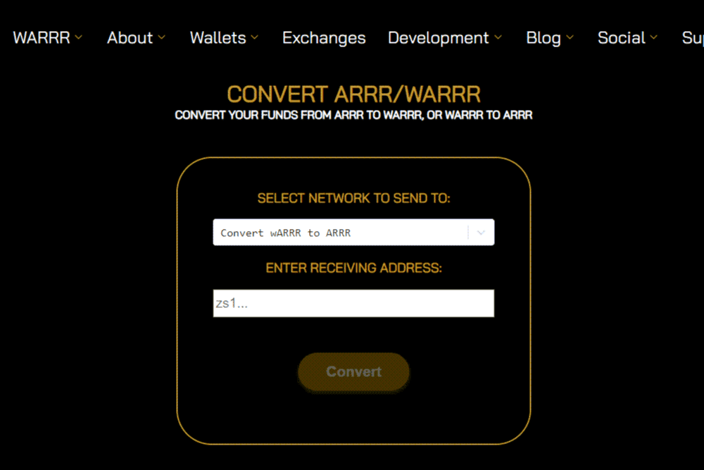

# wARRR

wARRR 是一个使用 BSC 代币的 dApp，可直接转换为 ARRR，一种 100% 匿名 P2P 交易加密货币。
wARRR 等于 1 ARRR，并且 wARRR 的当前供应量永远不会超过 ARRR 总供应量的 15%。
wARRR 在 PancakeSwap 上可用，它是唯一一个通过将其他 BSC 代币转换为 wARRR，然后使用 dApp 转换为 ARRR 来提供 DeFi 资金任意化的 BSC 代币。

有关交易的所有信息，包括发送方地址、交易金额、接收方地址、交易 ID，都不会公开披露。此信息仅供发送者和接收者使用，如果他们愿意，他们保留通过透露交易 ID 作为交易证明来选择退出隐私的权力。因此，海盗链颠覆了隐私行业，并通过赋予用户选择退出的选项来将隐私的力量还给用户。

