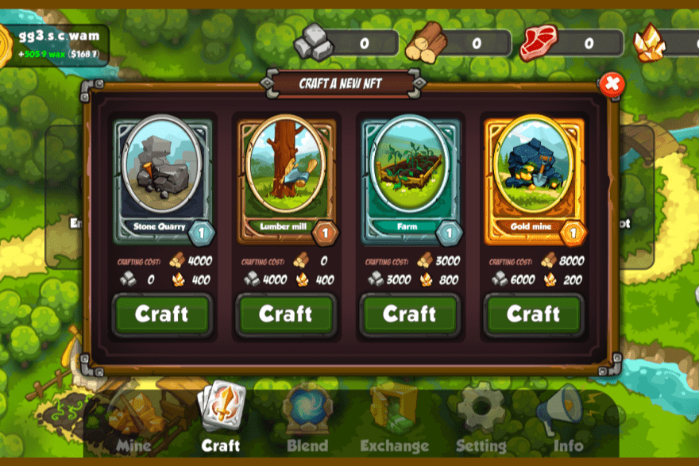

# Warspace

上一场战争彻底摧毁了所有强国的经济。和平实现了，发展和重建的竞赛开始了。但冲突尚未解决，过去的重演是不可避免的。只有时间会告诉我们是否会有新的赢家！
WarSpace 是一款基于 NFT 的游戏，在 WAX 区块链上开发。由于代币化经济，玩家自己控制市场并建立贸易关系。每个人都可以选择自己的道路：发展采石业、从事伐木业、恢复食品工业或深入地下寻找黄金。建造新建筑以及参与 pvp 战斗都需要资源。

