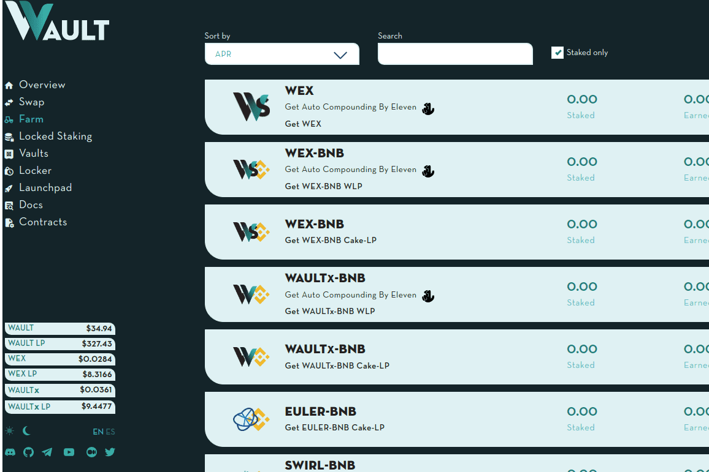

# WaultSwap

Wault Finance 是一个去中心化金融中心，计划在币安智能链上的一个简单生态系统中连接所有主要的 DeFi 用例。我们相信 DeFi 的好处应该以直观的方式为大众所接受；避免了许多当前平台的昂贵费用、混乱的界面和集中决策。因此，考虑到这些目标，我们构建了一个具有一些独特功能的协议，我们相信这将增强我们用户积累财富的能力。
此外，我们相信开放和去中心化的治理。这就是为什么 WAULTx 代币持有者将能够投票决定协议未来发展路径的各个方面。我们也欢迎每位开发人员参与我们的开源代码并为之做出贡献。快来加入这场运动，帮助我们在币安智能链上推进 DeFi！

