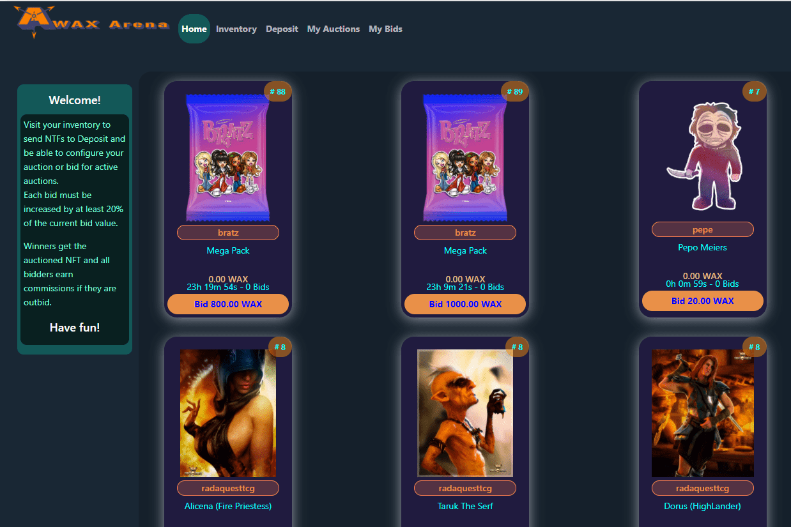

# Wax Arena

这个怎么运作？
WAX Arena 是由 3DK Render 为 WAX 区块链创建的游戏化拍卖系统。
从基本价格提供您的资产并设置拍卖持续时间。出价最高的人将赢得该资产。
为了创建拍卖，有必要将资产发送到存款。
每个出价都必须增加智能合约中的最低设置
每次出价时，当前出价与上一次出价之间的差额分配如下：

  上一个投标人的 10%。
  X% 给作者（按合集中规定）。
  3% 到市场。
  NFT 智能合约为 0.5%。
  资产所有者的剩余部分（60% - 86%）取决于作者的佣金。

