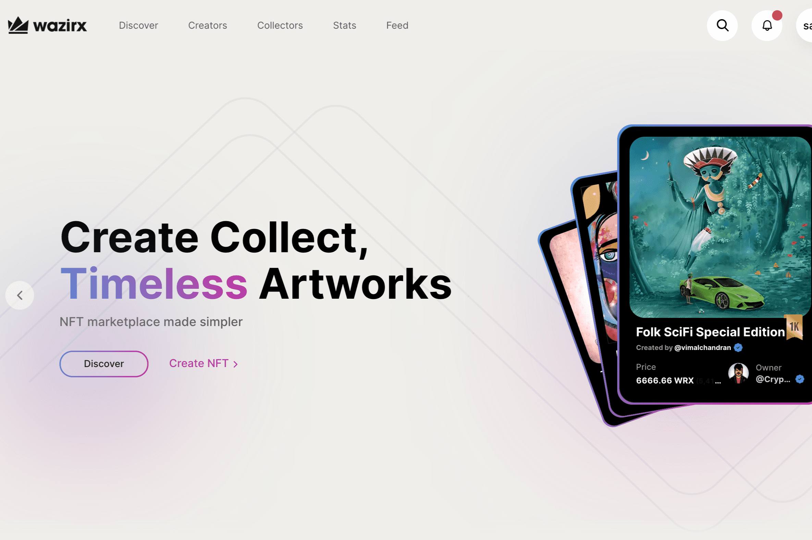

# WazirX NFT

WazirX NFT Marketplace 由印度最大的加密货币交易所 WazirX 推出，是南亚第一个 NFT 市场，为创作者和收藏家提供了一个可信的空间，以不可替代的代币 (NFT) 的形式获取和交易独特的独家艺术品。 WazirX NFT Marketplace 在印度和南亚开拓 NFT 领域，于 2021 年 6 月 1 日推出。

WazirX创始人Nischal Shetty这是印度第一个NFT市场，目前印度艺术家可以将其数字资产（包括艺术品，音频文件，视频甚至推文）放置在基于区块链的NFT市场上进行拍卖，以赚取版税。

