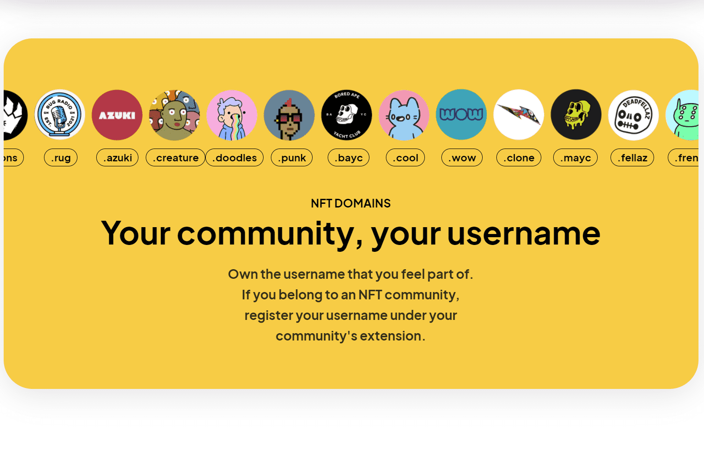

# Web3 Name Service

使用分散的用户名、网站和电子邮件域加入#TheWeb3Revolution。
您的 Web3 用户名允许您将您的以太坊地址映射到区块链和非区块链资源，将您的 Web3 世界的各个领域连接在一起。您可以通过您的用户名发送和接收付款、托管网站并展示您的 NFT 收藏。
你的社区，你的用户名
拥有您觉得属于其中的用户名。如果您属于 NFT 社区，请在社区的扩展名下注册您的用户名。
发送和接收付款
使用您的 Web3 用户名来存储您的所有地址并接收任何加密货币、令牌或 NFT。
建立去中心化网站
使用您的 WNS 名称启动抗审查的去中心化网站。将您的网站上传到 IPFS，或将您现有的 DNS 链接到 WNS。
安全地私有化您的电子邮件
加入 W3Mail：建立在区块链技术安全性之上的最安全、私密且易于使用的电子邮件。

