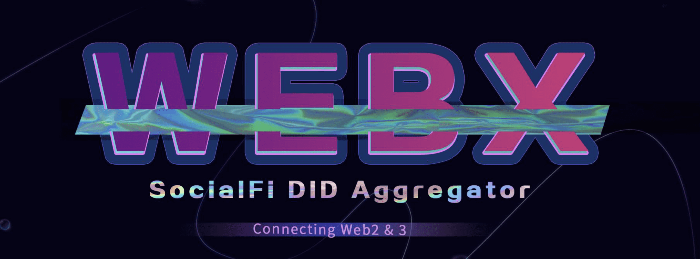

# WebX

问题解决了
WebX 是一个支持 DID（去中心化身份）的社交网络，具有创新的 NFT 经济。以无缝连接 Web2 和 Web3 为使命，WebX 提供了一个实现互操作性的门户，将社交媒体扩展到自有和去中心化的层，并将加密资产映射回来。 NFT 可以像您自己控制的其他常规内容一样被分享以获得乐趣并兑换成货币。

  不安全的个人数据处理和存储

WebX 背后的 DID 系统带来了便利性和安全性。它使用户可以使用一个帐户登录所有内容，并完全控制自己的个人数据。

  分离和未连接的网络将人们分开

WebX 提供的易于使用的门户连接不同的网络。用户将能够在多网络环境中享受乐趣，而不是在 Web2 和 Web3 之间切换。

  从技术中受益的加密货币原住民非常有限

WebX 通过其在 NFT 方面的创新帮助传播包容性利益。无需额外下载或注册即可在社交媒体上单击几下即可接收 NFT，这包含了更大的人群。

