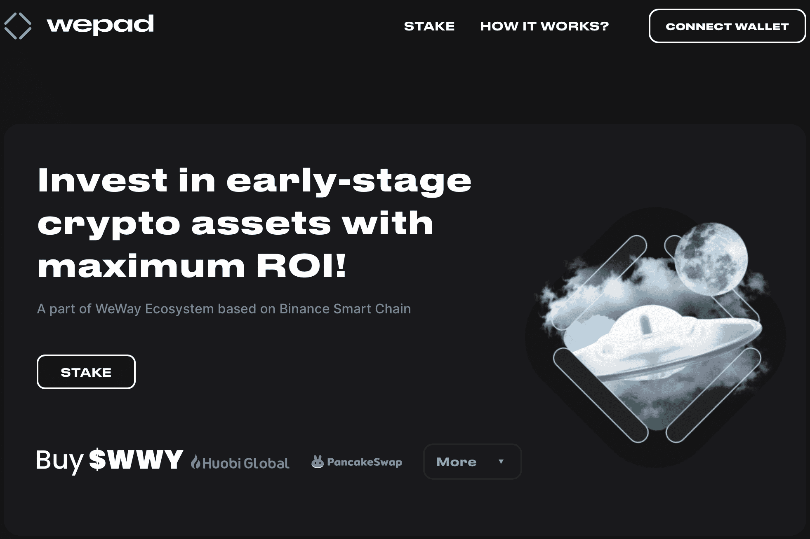

# WePad

什么是 WePad？

  IDO 启动板将为最好的加密初创企业开辟新的筹款机会。
  丰富的经验、世界级的合作伙伴关系和庞大的 KOL 网络让我们可以说 WePad 将到达世界顶级的启动板，并为项目和投资者提供非常高的投资回报率
  完全透明、与社区的密切互动和严格的选择方法将只允许启动顶级项目。这将早期投资者的风险降低到零。

WePad 上的项目分配将根据启动板独特的层级系统进行分配。总共有 6 层：前 4 层授予一定数量的 Power 点（您拥有的越多，您在 WePad 上分配的机会就越高），而第 5 层和第 6 层保证分配。根据您质押的 WWY 代币数量，您将达到某个等级：第 1 级需要 10,000 WWY；第 2 级 30,000；第 3 层为 100,000；第 4 层为 200,000；第 5 层为 300,000；第 6 层为 500,000。

您需要在代币销售前至少质押代币 3 天才能获得资格，如果您质押 30 天或更长时间，您将获得奖励：2-4 层的额外 Power Points 和增加的分配在第 5 层和第 6 层。此外，所有未售出的分配将在 FCFS（先到先得）基础上的所有层的特殊轮次中提供。

