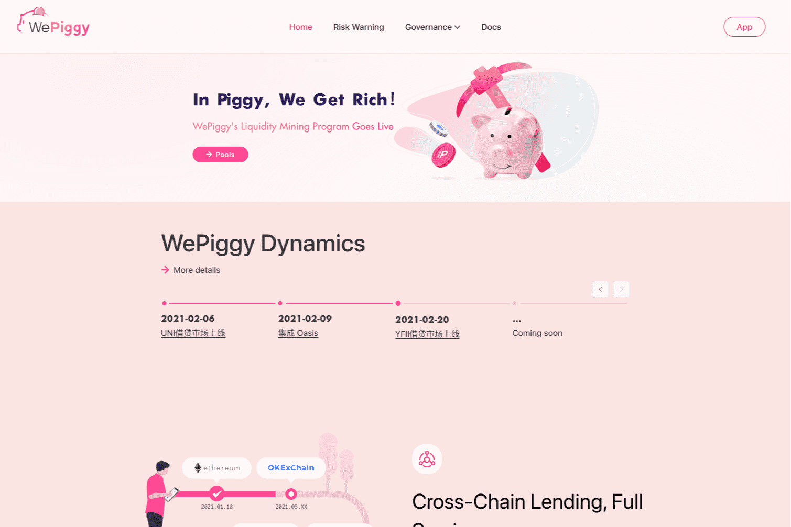

# WePiggy

WePiggy 是一个开源的、非托管的加密资产借贷市场协议。
在 Wepiggy 的市场中，用户可以存入自己的加密资产来赚取利息，也可以通过支付利息向他人借款。
与 Compound、Aave 等先驱者相比，WePiggy 希望为用户的选择创造更多的市场；优化智能合约的执行效率，降低gas成本；为用户提供更多的金融工具，不仅仅是闪贷，还有保证金、期权等。当然，所有的改进都是以用户资金安全为前提的。
此外，WePiggy 将尽最大努力为用户带来更好的用户体验。尤其是在东亚市场，会做更多的改进来降低用户的学习门槛。随着协议的逐步完善，WePiggy 可能会在这里为用户构建一系列 dApp。
在 WePiggy 的治理中，核心团队希望扮演更积极、更负责任的角色。我们相信目标和基本原则的重要性，我们完全理解高质量的治理不会发生在一个没有灵魂的项目中。
因此，在WePiggy治理初期，核心团队将积极参与治理，与社区共同形成科学治理的氛围。治理论坛上线后，我们将在第一个提案中与社区所有成员讨论 WePiggy 协议的基本治理框架

