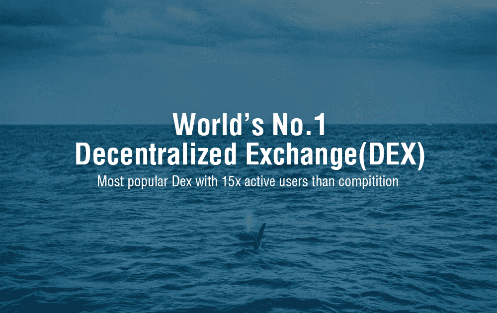

# WhaleEx

WhaleEx 是世界上最大的去中心化交易所。我们立志成为流动性最高的交易所。 WhaleEx 提供安全的资产托管、零交易费用和即时提款，提供用户友好的体验。 WhaleEx 是交易加密货币的最佳场所。 WhaleEx 部署在 EOS 主网上，是世界上第一个为去中心化资产托管实施多签智能合约的交易所。对智能合约和资产的任何更改都需要 WhaleEx、SlowMist 和 EOS 区块生产者的批准。这意味着即使我们的私钥被泄露，WhaleEx 的客户资产也将是安全的，并且 WhaleEx 永远不会出现行为不端。即使 WhaleEx 在物理上被抹杀，例如外星人入侵，我们的员工和服务器都被消灭了，WhaleEx 客户仍然可以在 EOS 主网上执行命令，在 10 天内收到他们所有的资产。 WhaleEx 是真正的去中心化交易所。 WhaleEx 开发了专有的跨链技术，以支持包括 BTC 和 ETH 在内的广泛资产。菲亚特开/关坡道也可用。 WhaleEx 满足所有用户的所有交易需求。 WhaleEx 一直激励着投资者。自成立以来，我们组织了 EOS 世界巡回演唱会，传播了 WhaleEx 快讯，并播出了 WhaleEx 直播。我们将很快推出 WhaleExpedia 以提供教育材料。 2019 年是去中心化交易所爆发的一年。虽然去中心化交易所仅占交易所市场的 0.01%，但我们预计市场份额将在三年内超过 90%。让我们共同努力，让去中心化交易所成为主流。 WAL 是 WhaleEx 发行的唯一代币。客户可以质押 WAL 获得等值的免费交易额度，实际上没有交易费用。免费交易额度每天都会重置。取消抵押仅需 3 天。进一步的用例包括质押 10,000 WAL 获得双倍宝箱奖励，质押 500,000 WAL 获得 40% 的一级邀请交易奖励（通常为 20%）。 WAL 将来会有更多与交易所相关的用例。

