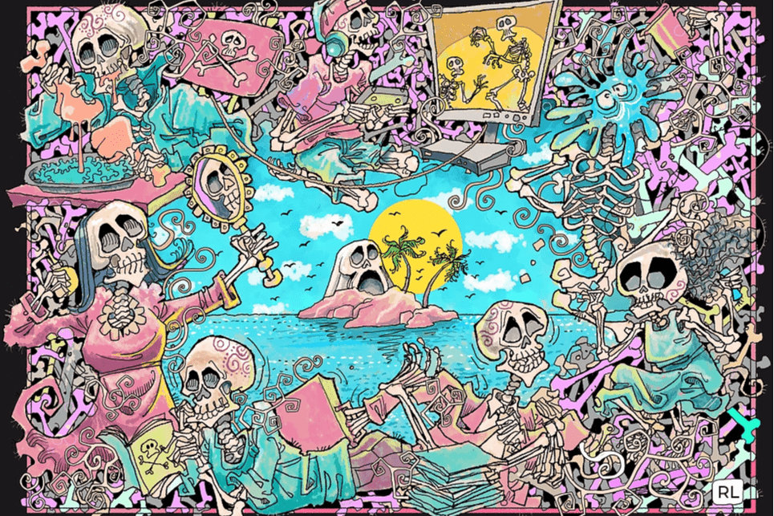

# Wicked Craniums

邪恶的颅骨是属于骨岛的 10,762 个颅骨的图形表示。每一个邪恶的颅骨。它们具有 180 多个可区分的特征。所以请留意你最喜欢的头盖骨！每个头盖骨也是您进入会员唯一社交平台 The Cradle 的门票。

Wicked Craniums 是真正的 Alt NFT 项目，专注于音乐、体验和活动。代表反叛者的 The Wicked Craniums 是 2021 年初始浪潮中最糟糕的 NFT 生成集合，具有无与伦比的实用性和该领域最专注的社区之一。凭借目前的合作伙伴关系，您可以参加 50 多个现场音乐节，甚至全球更多节目，Craniums 生态系统是您访问 IRL 和 Metaverse 音乐活动的通行证。

