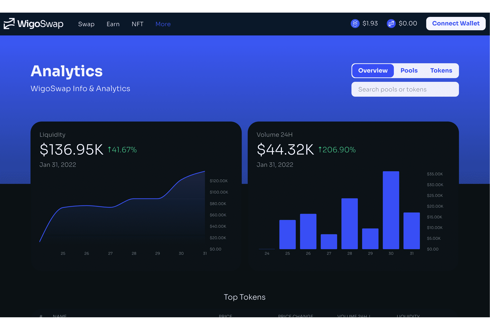

# WigoSwap

WigoSwap 是一个 DeFi 平台，它利用 Fantom 网络提供自动做市商（AMM）以及收益农业和 NFT 市场。 WigoSwap 为用户提供 DeFi 行业内快速、全面的协议。
WigoSwap 是一个去中心化交易所 (DEX)，也是一个用于抵押、种植、买卖不可替代代币 (NFT) 的平台。利用我们的 DeFi 协议，用户能够为 DEX 提供流动性，以去中心化的方式交易各种资产，并从分配给采用者的奖励中受益。考虑到现有解决方案固有的缺陷，WigoSwap 旨在重塑 DeFi 解决方案，强调其充分发挥作用。此外，平台密切关注引导用户提供的流动性以更积极的方式产生收益。
WigoSwap 为用户提供以完全去中心化的方式运作的全包金融服务。服务包括但不限于去中心化交易所（DEX）、质押平台以及流动资金池。此外，WigoSwap 受益于一系列几乎前所未有的功能，包括 NFT 集成和 DAO 治理，这些功能为重新安排 DeFi 领域内的元素铺平了道路。

