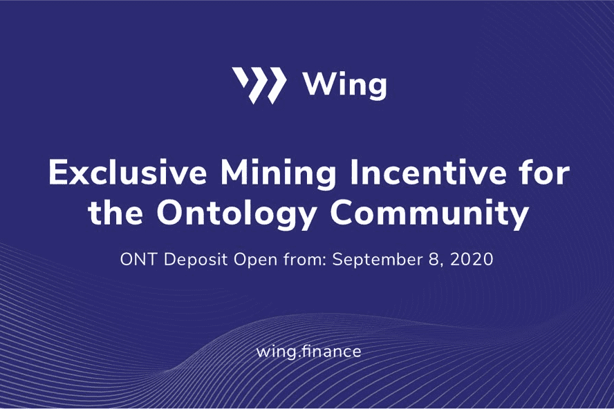

# Wing Finance

Wing 已经设计并正在构建一个专门针对数字资产借贷市场的 DeFi 平台，支持各种 DeFi 产品之间的跨链协同交互。 Wing 的去中心化治理模式和风险控制机制旨在促进借款人、债权人和担保人之间的互利关系。此外，Wing 创新地展示了信用评估模块，作为基于信用的 DeFi 的一个强有力的例子。

Wing 搭建了去中心化金融（）平台，支持各种 DeFi 产品之间的跨链协同交互。结合平台的去中心化治理模式，Wing引入的风控机制促进了借款人、债权人和担保人之间健康、良性的关系，允许在平台上实施更广泛的DeFi计划，从而为用户提供更多优质的DeFi产品质量。
Wing 展示了创新的信用评估模块，作为对 Wing 平台上 DeFi 信用产品的有力支持。

