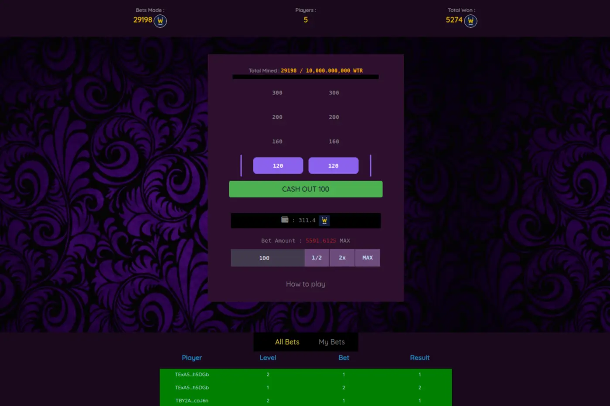

# Winktower

winktower 是 tron 上的一款使用 wink 代币玩的赌博游戏。押注区块和增加获胜级别，并且可以在任何级别兑现。

Winktower 是一个赌博 dApp。这是一个游戏化项目，可让您下注您的加密代币。您的赌注是针对区块的。也有不同的层次要经历。您最多可以赢取初始 TRX 赌注的 300%。

Winktower dApp 是一种基于Tron协议的赌博类别的加密资产。现在，根据用户数量，它在一般 dApp 排名中排名第 8395位，在赌博类别中排名第 378位，这让您可以很好地了解Winktower dApp 在其竞争对手中的表现。

通过分析最近 30 天窗口内的 Winktower dApp 数据，很明显 dApp 的Balance为$ 0.00，Volume稳定在$0.00。Winktower在 30 天内产生了0 笔交易，变化率为 0%。显然，与之前的 7 天相比，成交量稳定了0% 。最近 7 天的数据显示，Winktower用户基数为0并且稳定了0%。

