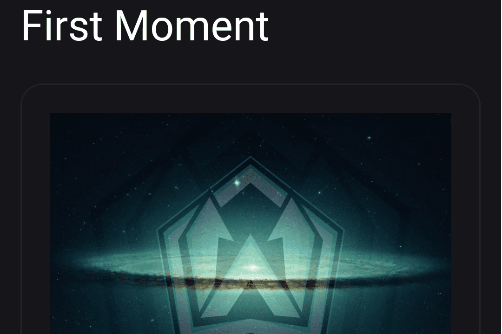

# Winlet NFT

Winlet NFT 是在 bsc 网络上使用 Bep20 创建的代币。 Winlet NFT 也是一个去中心化 (DApp) 市场和平台，成员可以在其中挖掘、销售或购买集成到该网络中的独特数字产品和加密收藏。当会员拥有这些独特的数字收藏时，他们会感到更快乐、更特别。 Winlet NFT 的主旋律是基于<那一刻>，它的出发点是为了将其转移到数字媒体上。 Winlet Nft 的目标是成为该领域的领导者并为其成员提供最优质的服务。

