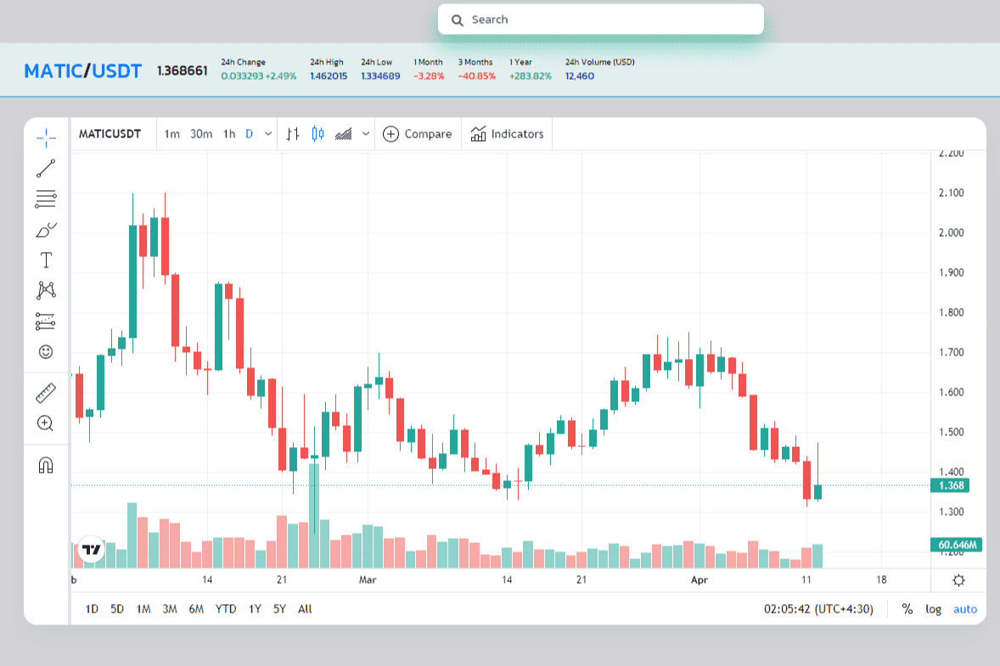

# WinSwap

我们的目标是支持 DeFi 市场中的所有代币并降低进入门槛。 WinSwap 支持 5 条链中超过 10K 的代币：以太坊、币安智能链、Polygon、Fantom 和 Avalanche。

WinSwap 是一个专业的 DeFi 仪表板，将最流行的 DeFi 协议和区块链聚合在一个 dApp 中。WinSwap 创建了一个对有经验的用户和新手都很有用的一体化解决方案。

使用 WinSwap，用户可以从一个直观的界面轻松管理他们的 DeFi 投资组合。使用 Metamask 或任何其他 web 3.0 钱包可以轻松解锁仪表板。

