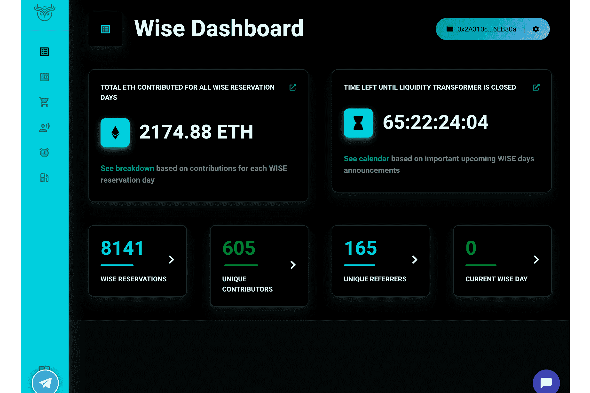

# Wise

Wise是Steem之上的第二层投票协议。 Wise仅允许您安全地允许其他用户在您指定的条件下使用您的投票能力。您可以以某种方式配置明智之举，以便您的朋友能够使用您的投票，例如，每周只能使用一次。WISE是一种资产支持的加密货币，旨在成为一种高度安全的价值存储。选择任何时间来锁定WISE并在这段时间内赚取收益。更长的股份有更大的盈利能力。在三种质押模式之间进行选择。将WISE借给储备池并从 Wise 生态系统中受益，或将WISE借给保险库，以获得基于供需的一致回报。在全套加密货币的多种借贷策略中进行选择。为合作伙伴 DEX 上的WISE代币对提供流动性，为 LP 提供激励。享受无常损失的低风险并实时收集奖励！

