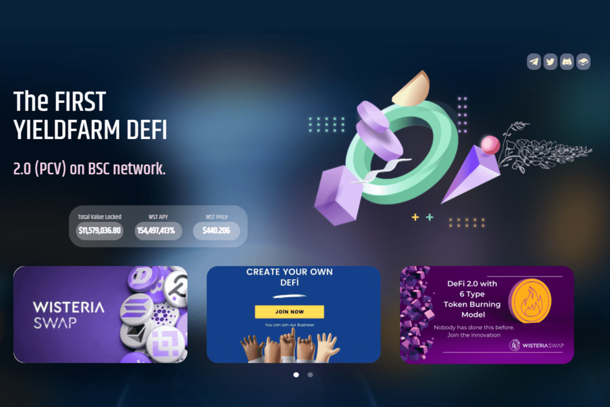

# Wisteria Swap

无法通过代币销毁来控制通货膨胀的服务最终会下降。这样一来，WisteriaSwap 就会满足很多期待。
WisteriaSwap 是 DeFi 2.0 形式的 YieldFarm DeFi 服务。 （它不是奥林巴斯 DAO 分叉链。）
WisteriaSwap 克服了“流动性挖矿”的限制，因为大部分 WST-BUSD LP 都归该协议所有。除此之外，WisteriaSwap 与稳定币系统不同，因为它使 YieldFarm DeFi 系统保持完整。
这就是为什么 WisteriaSwap 与可持续的代币燃烧模型一起工作的原因。 Blokfiled.INC 通过 RobiniaSwap 的基金系统 Delegate Farm 系统证明了可持续的 YieldFarm 服务是可能的。
因此，WisteriaSwap 增加了一个可以控制通货膨胀的通货紧缩模型。
服务特色

  Auto WST(Automatic Restaking) 质押在池中的 WST 会自动收获并重新质押（Compounded）。该服务将为用户提供最高级别的APY。
  DeFi 2.0（不再持有LP。）协议主要拥有WST-BUSD LP。 Wisteria 用户可以安全地使用 YieldFarm DeFi 服务，同时将“无常损失”降至最低。
  提款费 在三天内提款时，您可能需要支付高达 2% 的提款费。
  WisteriaSwap 是为“看涨期权”开采的，具有一定的 WST 发行百分比，并且只有开采的 WST 通过“看涨期权”分配。看涨期权允许用户以低于市场价格的价格购买 WST。

