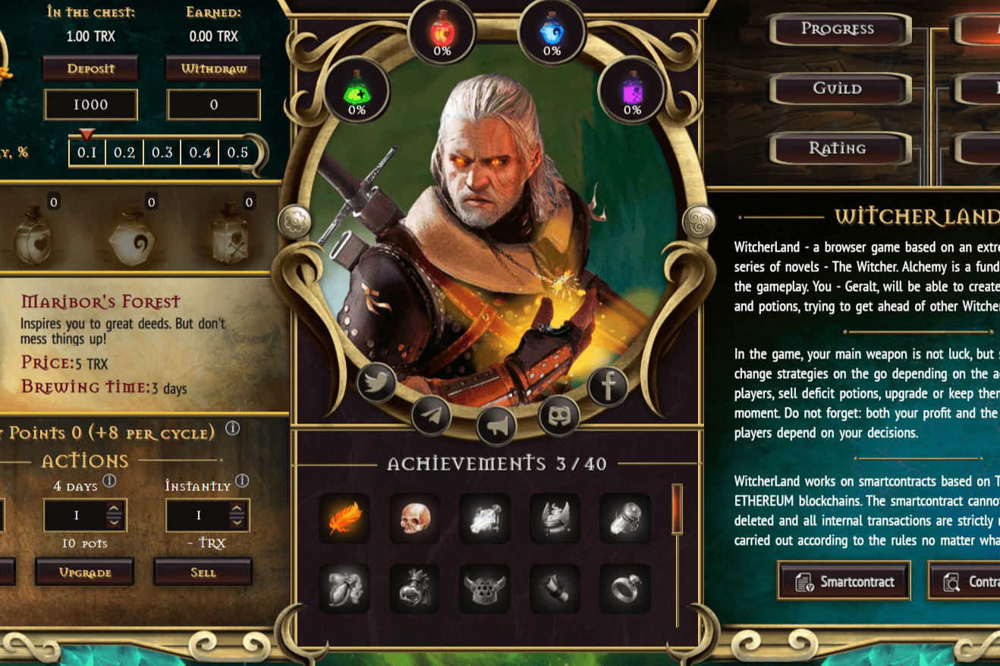

# Witcher.Land

WitcherLand - 基于极受欢迎的系列小说的浏览器游戏 - 巫师。炼金术是游戏的基本组成部分。你 - 杰洛特，将能够创造不同的灵药和药水，试图领先于其他巫师，运用这门手艺。
在游戏中，你的主要武器不是运气，而是技能。根据其他玩家的行动，在旅途中思考和改变策略，出售赤字药水，升级或保留它们直到更好的时刻。不要忘记：你的利润和所有玩家的利润都取决于你的决定。
WitcherLand 致力于基于 TRON 和 ETHEREUM 区块链的智能合约。智能合约不能被修改或删除，所有内部交易都受到严格监管，无论如何都按规则进行。
该游戏需要 TronLink 浏览器扩展程序和余额中的一些 TRX 硬币。要在您的移动设备上玩游戏，请使用 TronWallet（iOS 和 Android）。
WitcherLand 合约余额取决于玩家的补货，并根据网站上描述的算法进行分配。游戏本质上是娱乐性的，不应被视为投资工具。

