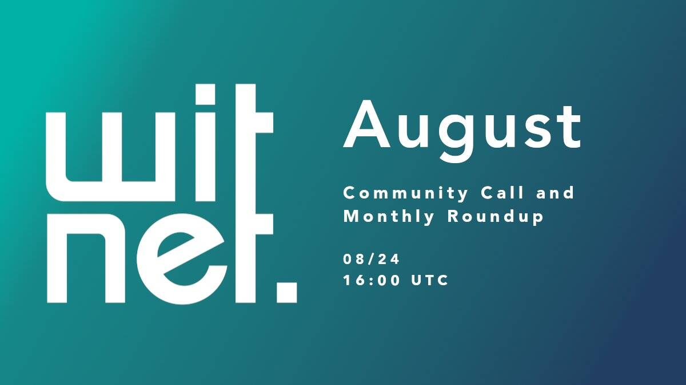

# Witnet

WITNET协议创建了一个覆盖网络，该网络将智能合约连接到任何在线数据源。运动结果，股票价格，天气预报，随机源甚至其他区块链可以轻松查询（最好通过API）。
该协议描述了一个同行节点的分布式网络，该网络被称为证人，他们赢得了WIT代币作为检索Web数据并将其直接报告给智能合约的奖励。
最重要的是，从一个或多个来源检索信息的随机选择的匿名同伴会收集到一个单一的真相，如果他们激励他们诚实地报告他们检索到的数据，以诚实地报告检索到的数据，他们会受到惩罚或削减任何内容。不当行为，他们采用了解决不一致之处的通用共识算法。

