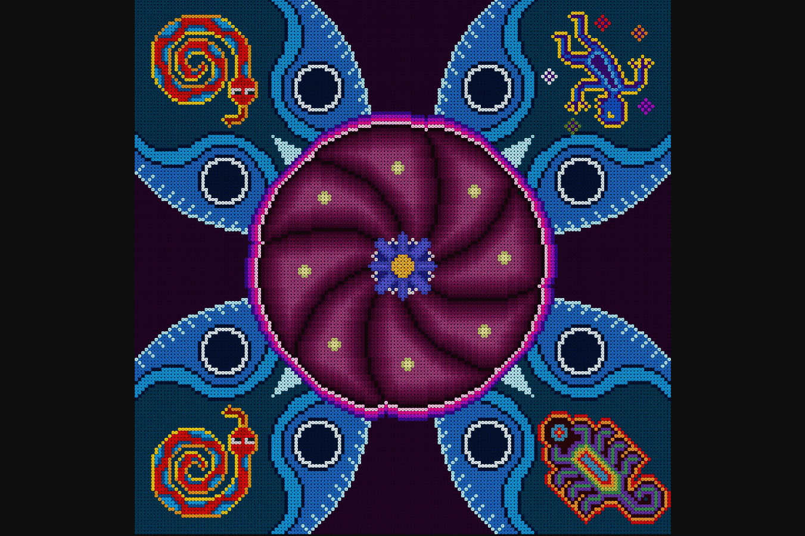

# Wixa

Wixa彩色和像素化的收藏品在以太坊Blockhain上推出。Wixárika 是一个土生土长的墨西哥族群——不恰当地命名为 Huicoles——他们自前西班牙时代以来一直设法保持自己的文化身份。Wixárika 艺术的起源可以追溯到远古时代，当时萨满创造了代表神灵和神圣动物的人物。他们的灵感来自仪式，这些仪式让他们能够提升自己的思想，穿越到未知世界并与他们的神灵亲密接触。Nierika 是“视觉的礼物”，访问“祖先神的视觉”。在他们的艺术中，Wixáritari 烙下了他们对 Nierika 的看法。

