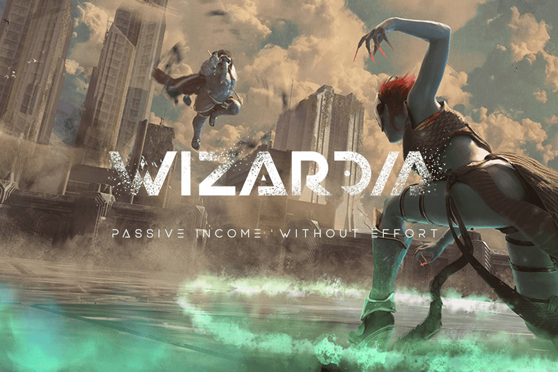

# Wizardia

Wizardia 是一款靠游戏赚钱的游戏，拥有丰富的知识、引人入胜的战斗机制、专注于身临其境的法术发现以及高回报的制作系统。
设置在一个由魔法增强的未来世界。
Wizardia 的前沿艺术风格是黑暗幻想和科幻的独特组合。
战斗是Wizardia不断发展的一部分，玩家必须不断适应战场的变化。只有一个胜利者，所以赌注很高。
根据令人兴奋的新技术，我们设计了以 NFT 为核心的 Wizardia 世界。这些 NFT 是独特的虚拟资产，既具有游戏用途，又具有现实价值。
通过这种方式，我们不仅向玩游戏的人介绍了赚取主动和被动收入的可能性，而且还向所有热爱巫师并希望支持该项目并在此过程中获得收入的人介绍了赚取主动和被动收入的可能性。

- 活跃的玩家将获得作为游戏基础的 Wizard NFT 的好处。它们可以随着时间的推移进行改进以增加价值，然后出售、交易或出租给其他玩家。

- 无需参与游戏的被动收入元素 - 获取并持有 Arena Genesis NFT 以获得被动收入。被动收入来自竞技场内进行的所有战斗和交易。

  
