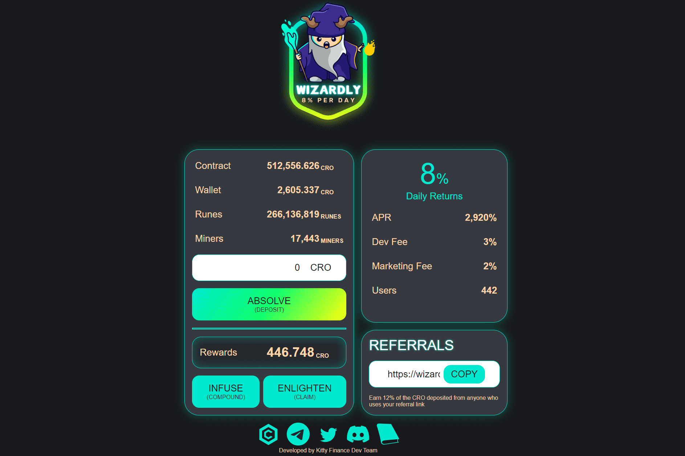

# Wizardly

Wizardly 是 CRONOS 链上主题丰富的 Token Miner。这是一个简单的智能合约，充当 $CRO 奖励池，只要奖励池中还有 $CRO，每天都会返回池中 8%* 的 $CRO！
当用户积累更多的 $CRO 代币时，他们可以选择注入（复合）或开悟（声称）。
Wizardly 合约经过验证、开源、不可变、值得信赖，并且在 https://cronoscan.com/ 上可见
力学：

1. 免除您的 $CRO 代币（存款）
  2.每天输注6天...（复合）

2. 在第 7 天，让魔法启迪你（声称）

3. 召集你的施法者同伴，用他们的克罗诺斯标记帮助我们，这样仪式就可以传播到所有人。
  我们的费用如下：
  5% 的存款和索赔费用

  
