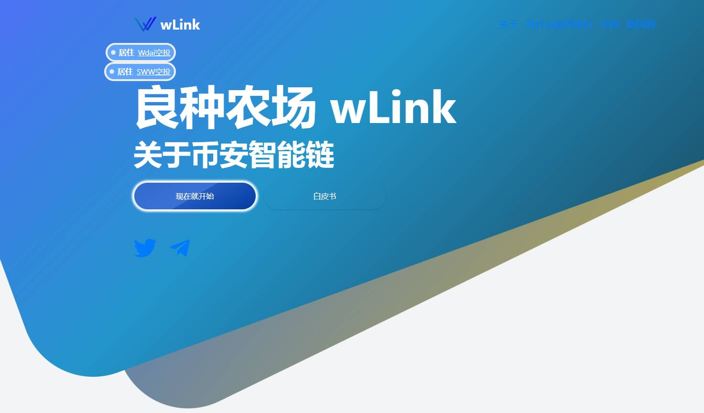

# wLink

介绍
尽管去中心化金融（DeFi）继续掀起波澜并保持其抛物线式增长，但单产农业仍然是从长期持有中产生回报的流行工具。对于外行来说，收益农业只是将您的资产投入平台以赚取收益的行为

赚钱固然好，但一起赚钱更好。我们选择与世界分享我们的成功，以提高社区、您的家人和您的银行账户的生活水平。

wLink 将通过提供所有交易的详细和实时日志来提高交易的透明度。我们将尽可能透明，同时保持竞争力

Smart Chain 的低交易费用让每个人的交易变得简单。

利润（股息）每天实时计入您的账户。您可以随时提取股息。

