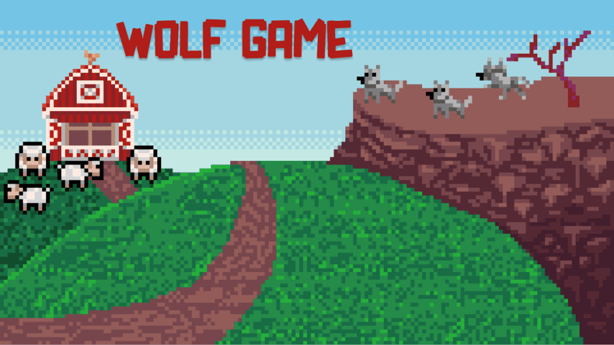

# Wolf Game for Solana

第 1 到 10000 个 NFT 的铸币费为 1 SOL。
第 10001 到 20000 个 NFT 的铸币费为 20000 Fleece 代币。
第 20001 到第 30000 个 NFT 的铸币费为 30000 Fleece 代币。
第 90001 到第 100000 个 NFT 的铸币费为 100000 Fleece 代币，永久铸币没有上限。
有 80% 的机会铸成羊，20% 的机会铸成狼。
狼的 alpha 属性范围从 4 到 8，每个 alpha 值都有相同的机会被铸造。
羊质押后，每天可生成10000个Fleece代币，但只能认领70%。
所有质押的狼根据各自的 alpha 值分享 Fleece 代币每日总产量的 30%。
例如，现在总共质押了 8 只羊和 2 只狼，每天总共生产 80000 个 Fleece 代币。
每只羊可以获得 7000 Fleece 代币。 2 只狼共享 24000 Fleece 代币。
其中一只狼的 alpha 为 4，另一只狼的 alpha 为 8，则前者可以获得 24000x4/(4+8)=8000 Fleece 代币，后者获得 16000 Fleece 代币。
如果长时间没有领取，羊领取时可以获得最近三天的抓绒令牌，而狼只能拿到最后一天的抓绒令牌，所以狼需要每天进行领取才能获得利益最大化。
获得的 Fleece 代币可以在 DEX 上交易，铸造的 NFT 可以在 NFT 市场上交易。

