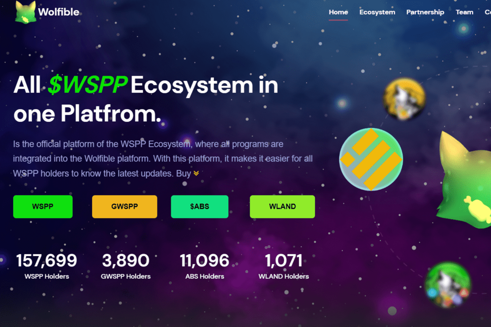

# Wolfible

WolfIble 追求的目标是创建一个高度流动的环境，每个人都可以轻松且廉价地创建 NFT，正如我们所知，WolfSafePoorPeople (WSPP) 代币是一个具有帮助世界上所有穷人的愿景和使命的代币，所有人都可以体验到 Wolfible制作 NFT 并努力赚取额外收入。
Wolfible 被设计为由社区拥有和管理的所有人的 NFT 协议。在这方面，该计划中为 WolfSafePoorPeople $WSPP 原生治理令牌保留了一个特殊位置，作为未来 NFT 生态系统的基础构建块。
使用 Wolfible，您可以：

  创建卖单💰
  为拍卖创建/接受出价
  为常规卖单购买代币
  创建 Mint NFT ERC721 和 ERC1155 代币
  制作普通薄荷
  转移代币
  烧掉代币
  打开盲盒
  NFT 农业
  产量农业和游泳池
  GameFi（很快！）

