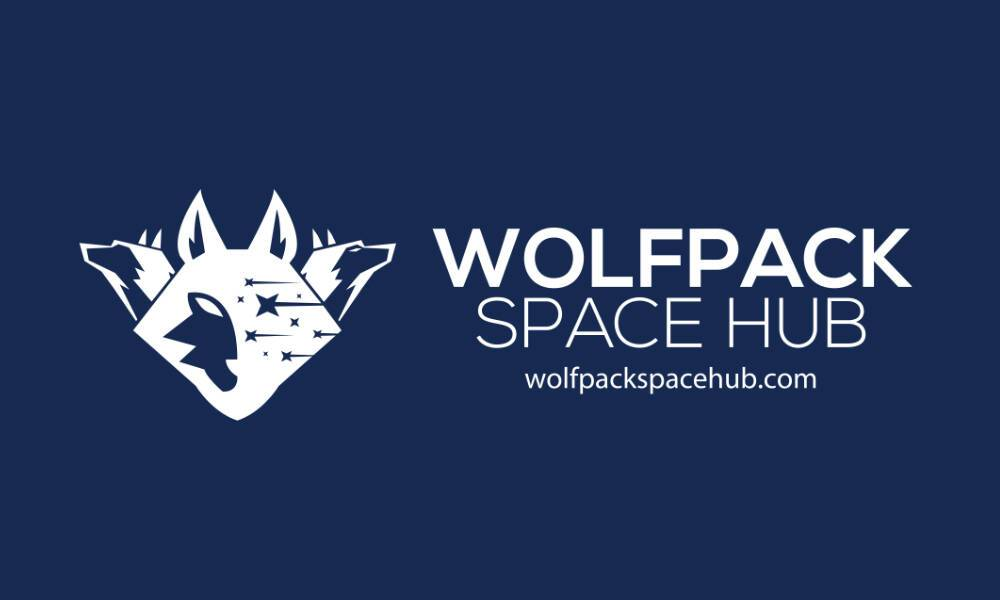

# Wolfpackspace

Wolf-Pack：由 Wolf-Pack 合约和流动性池提供支持的币安智能链上的链上期权交易协议。
Wolf-Pack 是 Wolf-Pack 合约的无信任创建、维护和结算协议。 Wolf-Pack 合约是一种类似于期权的链上合约，它赋予持有者（买方）以特定价格（行权价）购买或出售资产的权利，并赋予作者（卖方）购买的义务或在一定时期内出售资产。对于希望保护其资产免受价格下跌影响的市场参与者以及可能发现编写 Wolf-Pack 合约的回报足以将其部分资金分配到流动性池合约的流动性提供者而言，它可能很有用。在传统（CBOE、CME 等）或加密资产（Deribit、FTX 等）上，期权交易所的持有者和作者是个体代理人（零售或机构）。这意味着在交易期权的同时，他们的资金承担着独立的风险和收益，他们的交易结果与其他市场参与者的损益无关。在卖方（作者）方面，Wolf-Pack 流动性池合约同时从许多市场参与者那里积累流动性。这种方法在为流动性提供者提供回报的同时，降低了损失资本的风险（潜在的下行风险）。

