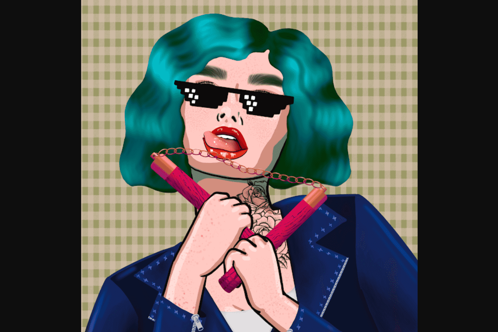

# Women and Weapons

Women and Weapons 汇集了 10,000 名多样、美丽和糟糕的女性 NFT。构成这些资产的 200 多个属性由著名艺术家 Sara Baumann （又名“Sparky”）精心手绘。每一次中风都是爱的劳动，需要数月的计划才能组装。这是一个拥有她有史以来最大、最大胆的艺术收藏品的机会。
所有收益的 5% 捐给马拉拉基金会慈善机构，以便全世界的女孩和妇女能够接受教育，使她们能够领导。所以请帮助我们帮助女孩们将知识变成他们的武器。

