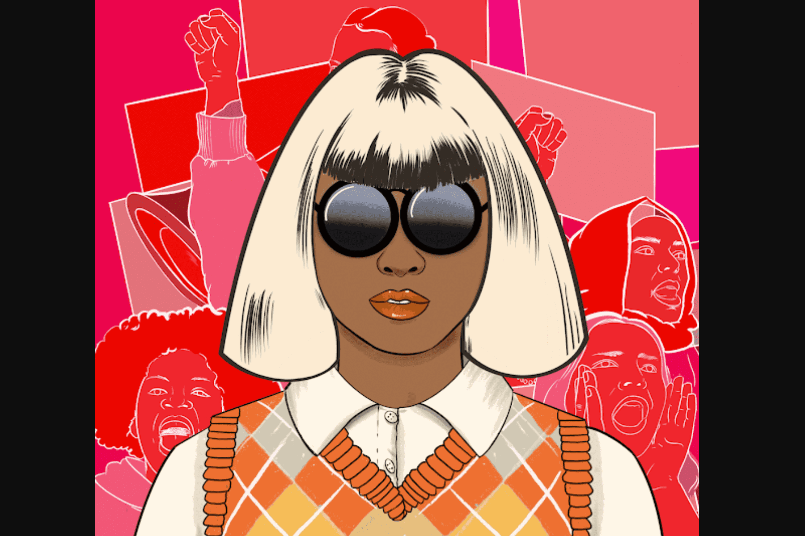

# WomenRise

我们专注于通过 NFT 和 Web 3.0 促进妇女权利和女童教育。我们的最终目标是为全球 2.58 亿无法接受教育的儿童建造虚拟世界中的第一所学校。其中1.29亿是女孩。
Women Rise 是世界著名艺术家、作家和活动家@Maliha_z_art 的收藏。在过去的 9 年里，她一直专注于通过她的艺术、写作和激进主义倡导社会正义，包括妇女权利、性别平等和女孩教育。她曾与联合国、全球目标、马拉拉基金、Adobe、谷歌等许多令人惊叹的组织合作。她的作品曾在《纽约时报》、《早安美国》、BBC、TRT World 等各种媒体平台上亮相。

