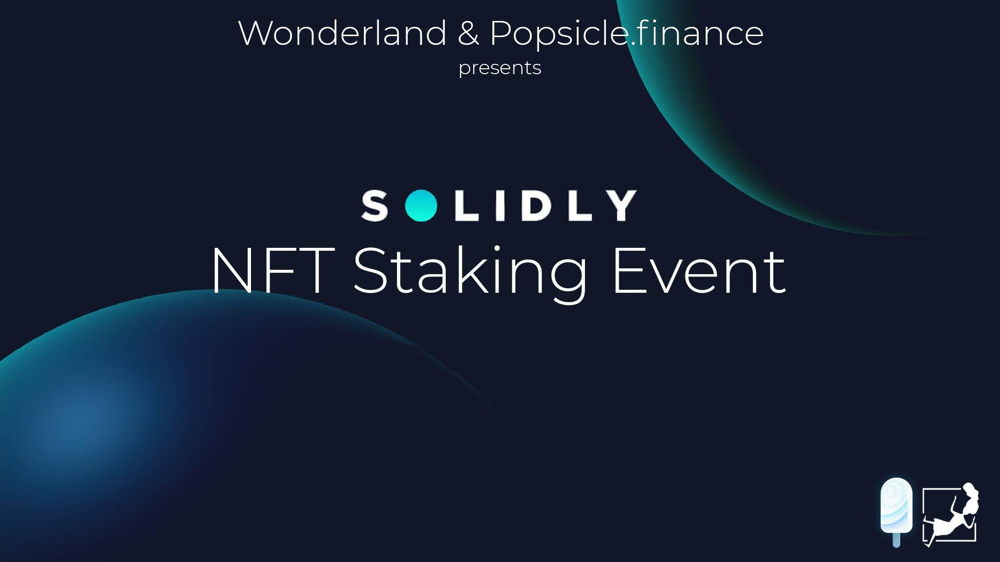

# Wonderland

Wonderland 是 Avalanche Network 上第一个基于 TIME 代币的去中心化储备货币协议。每个 TIME 代币都由 Wonderland 宝库中的一揽子资产（例如 MIM、TIME-AVAX LP 代币等）支持，赋予其不可低于的内在价值。 Wonderland 还通过质押和铸币将经济和博弈论动态引入市场。

Wonderland 是一个去中心化的自治组织，由其治理代币控制。

要参与 DAO，用户需要从公开市场购买 wMEMO 代币。这些代币可用于对协议提案进行投票并指导项目的未来。

他们还可以参与收益分享合同，以从财务业绩中受益。

