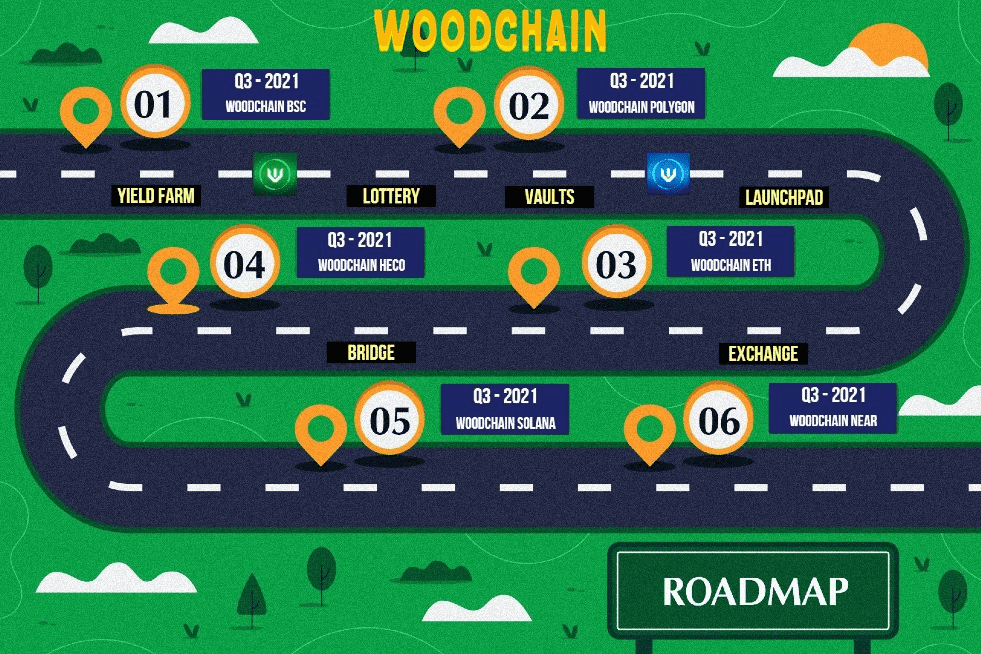

# WOODCHAIN

WoodChain 是一种去中心化金融，其使命是为用户带来最大的用处。 Wood Chain 是一个基于 ETH、BSC、POLYGON、HECO 等众多智能链网络的一体化平台。
在 Wood Chain，我们的目标是开发一个 DApp，它可以帮助您轻松地在网络之间转换您的加密货币，目标是快速、便宜和安全。
因此，考虑到这些目标，我们将在一开始就在 BSC 和 Polygon 网络上构建我们的项目以及一些独特的功能，例如：Wood Yield Farming、Wood Launchpad、Wood Exchange、Wood Vaults、Wood Bridge 和许多其他优质服务。

