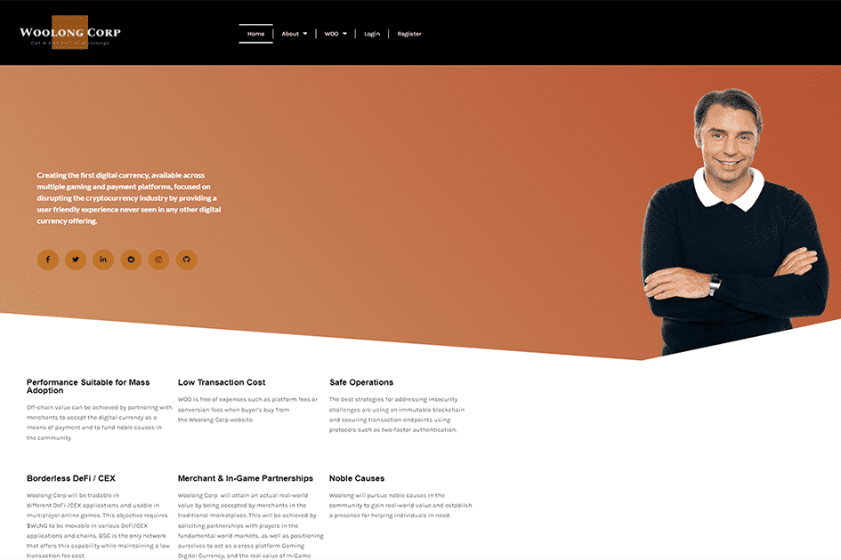

# Woolong

创始人创建了 Woolong 的“WOO”，以解决数字货币与更广泛的用户群之间的脱节问题。我们承诺和我们的资源来挑战当前数字货币用户体验的“传统风格”。 Woolong Corp 专注于模糊选定的精通技术的用户和更广泛的用户群之间的界限，包括所有想要参与数字货币革命的人。通过简化这种体验，WOO 有助于促进数字货币发展和采用的下一阶段。有什么比 WOOLONG (WLNG) 更好的抵押品了，WOOLONG 是在比特币创建之前首次亮相的首批数字货币之一。 WOO 是一种星际公允价值硬币，类似于 Cowboy Bebop、Space Dandy 和 Carol & Tuesday 动漫类型中所描绘的硬币。
路线图 2022 - 2023
第一季度 - 上市和领导收入流和初始资本筹集 - 招聘首席运营官、首席财务官和首席营销官，启动社交媒体活动。在交易平台上列出 Woolong。运营标准化、产品和服务目录、投资者的 RFI、
Q2 - 招聘和社交媒体主导地位、合作伙伴关系和 - ICO、Recruit 品牌专家、合作伙伴网络电影和电视、游戏内合作伙伴关系。
第三季度 Noble Cause 参与和持续增长 - Noble Cause 赞助，审查核心业务。
第四季度审查和改进：审查和调整产品、服务、合作伙伴关系和合同，以维持正增长并保持行业内的竞争性运营。
2023
筹资、收购和保护扩张 - 公开 IPO 考虑，筹集资金以扩大 Woolong 的采用，收购一家提供补充服务/专业知识的小企业。

