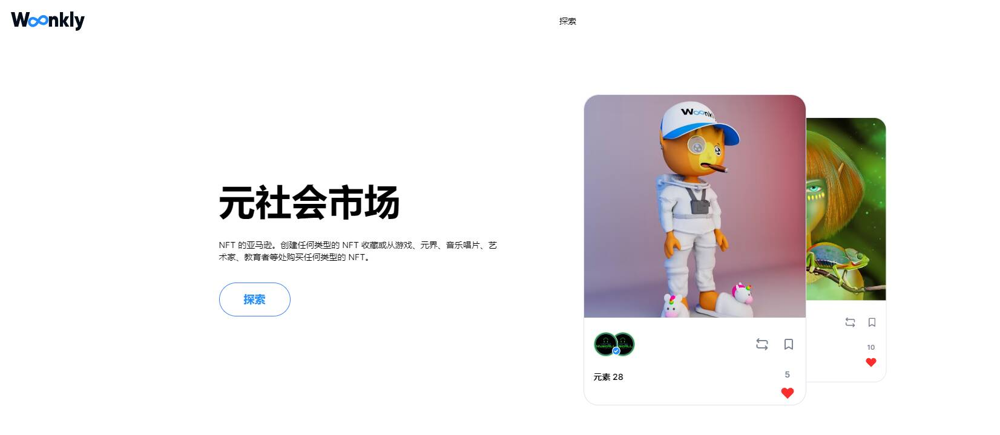

# Woonkly

Woonkly Metasocial Network 是一个去中心化的社交网络，所有帖子都直接转换为 NFT，用户可以完全控制他们的数据，并且内容不会上传到服务器，而是通过 IPFS（星际文件系统）上传到用户的计算机，从而允许创建一个由创作者、影响者、人才、用户和虚拟世界组成的分散式全球目录，彼此互动并创造新的内容货币化方式。
创作者可以上传他们的视听作品并为其设定版税。几乎任何类型的媒体文件都有资格转换为 NFT。从歌曲到视频剪辑，从播客到书籍，从自拍到虚拟世界。
Woonkly 的使命是通过恢复用户的权力来分散社交帖子，同时允许他们通过 NFT（不可替代的代币）和游戏化以新的方式获利。

