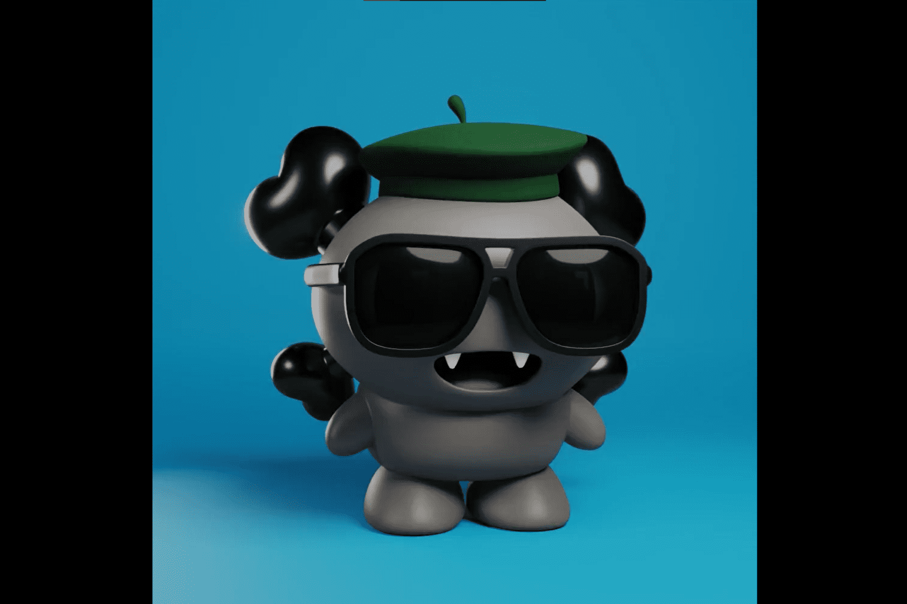

# Wooshi World Collection

Wooshi World 的限量版 Genesis Minting 包括 11,111 个程序生成的多彩元伴侣，以及数百个受游戏文化启发的配件。
每个 Wooshi 都有动画并完全以 3D 呈现。目标是为 Wooshi 带来生命，以便与角色建立有意义的联系。所有 Wooshi 都是 3D 动画伴侣。这些 3D 生物看起来非常可爱，但它们顽皮的本性势必会动摇一切。Wooshi是一种原产于戈尔岛的微小生物。Wooshi虽然外表娇小甜美，但内心却在纵容。动画以令人着迷的循环播放，永远不会令人眼花缭乱并引起人们的兴趣。生产这种规模的项目是 NFT 领域的一项重大成就。团队在美术开发阶段从不偷工减料。渲染 3D Wooshi 花了 4,000 多个小时。

