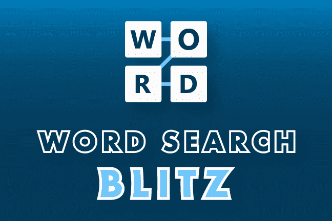

# Word Search Blitz

你喜欢拼字游戏吗？试试我们全新的拼写难题。Word Search Blitz 拥有一个 30,000 多个单词的大型数据库，每个谜题随机选择每个游戏的玩家单词列表。创造数百万种不同谜题的可能性。这个闪电般的快速游戏让游戏有 60 秒的时间找到 12 个术语。当玩家找到一个单词时，游戏会额外奖励玩家 5 秒。这不是你奶奶的单词搜索，它很难，节奏快，非常具有挑战性。

- 无尽的游戏和游戏可能性
- 目录中的数千个单词
- 数百万个可能的谜题
- 60 秒开始游戏
- 每个正确答案 5 秒奖励
- 闪电般的快速游戏

游戏当然非常难，每次玩都会挑战玩家。游戏玩法很简单，只需引用单词表中的术语，找到它隐藏在拼图中，然后将手指放在起始字母上并将其拖到单词末尾即可突出显示。继续这个，直到时间用完或游戏完成拼图。

