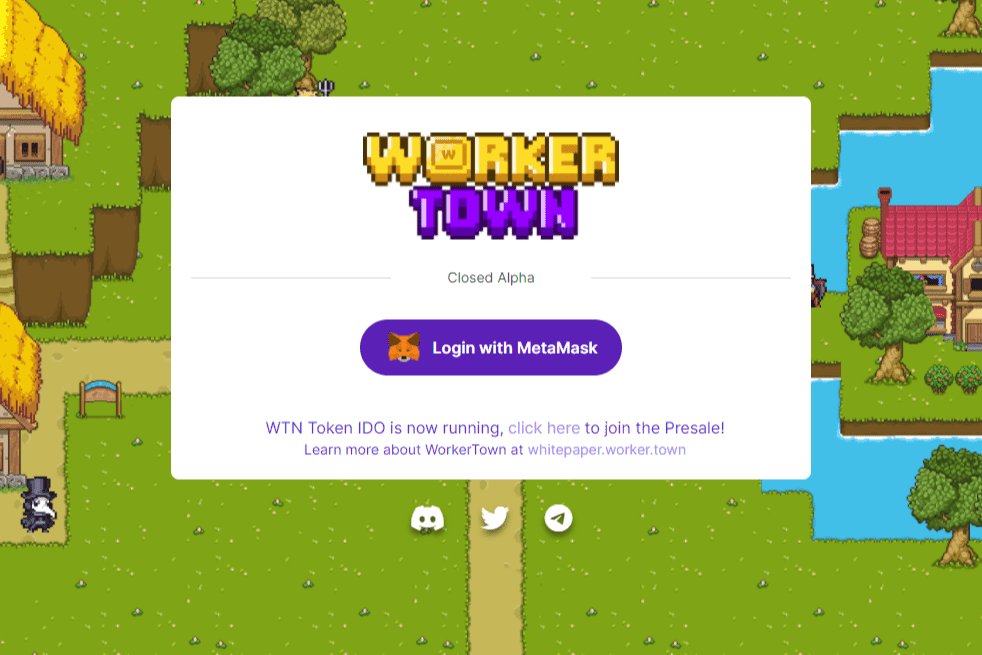

# WorkerTown

WorkerTown 是一款游戏，灵感来自于许多系列通过像素艺术获得的游戏，带来了一种挑衅的外观和治愈的美学。成为拥有自己城镇的房东，您可以选择其中任何一个；从收养工人让他们在你的城镇工作以获取薪水，让他们繁殖以获得强大的组合或购买房子让工人更快地休息，甚至租用你自己的床。
WorkerTown 建立在币安智能链之上，让玩家可以完全控制他们的数字资产，参与愉快的游戏环境。房屋和工人都将按照 ERC-721 标准铸造，可以在我们自己的 NFT 市场上自由交易。
我们的主要目标是为玩家创造一个平衡的长期游戏环境，让他们享受他们的日常游戏任务，同时能够与需要低入门成本游戏的其他人和选择高入门成本游戏的人合作也是。

