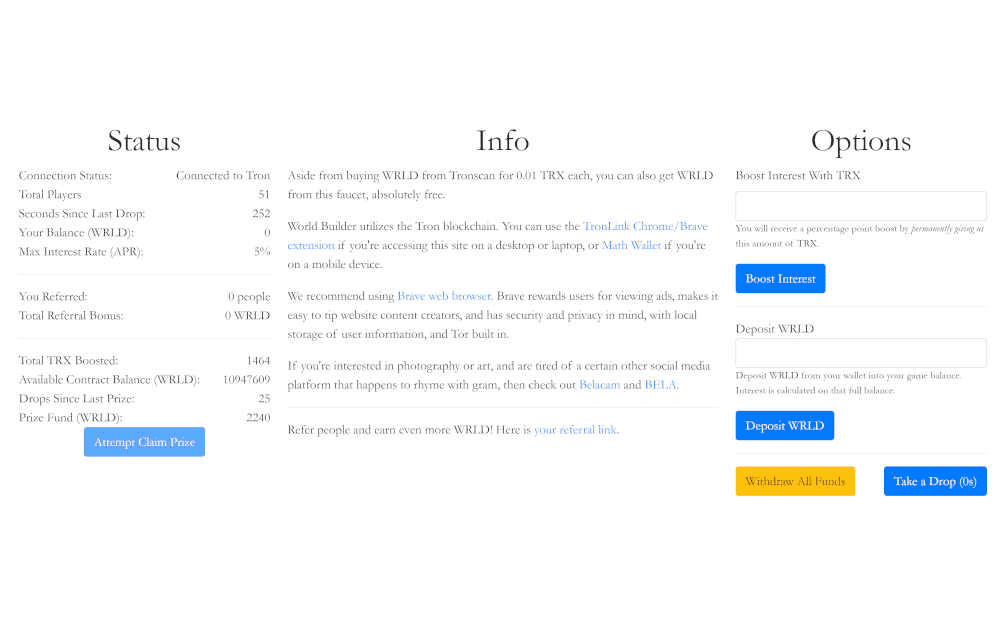

# World Builder

World Builder 是一个通过区块链和加密资产技术改善自由和繁荣的长期项目。目前它处于“IGO”阶段，类似于 ICO，但游戏化了。World Builders 是 NFT 的集合，它们提供了一个框架来构建众多世界，个人可以在其中创造、玩耍、探索和参与其中。NFT 集合构成了每个连续世界的支柱，每个 NFT 都代表所有世界，而每组构建者都保留了为每个世界定制 NFT 解释及其基本特征的能力。我们 World Builders 将创建第一个世界，一个受中世纪幻想启发的环境，以及一个角色扮演和策略游戏，以展示 World Builder NFT 基础设施可以做什么，并期待看到由您（社区）构建的后续世界。

