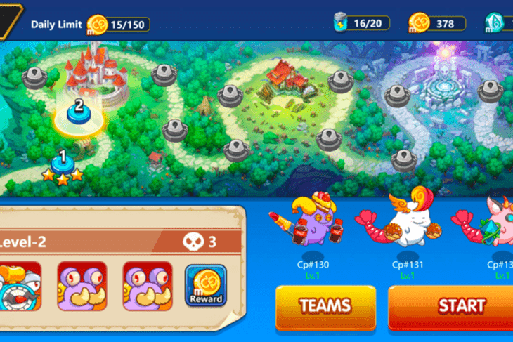

# World Of Cryptoids

在 World of Cryptoids，我们正在打造一款大型多人在线游戏。一个受到口袋妖怪启发的元宇宙世界，玩家可以使用各种基于区块链的代币来繁殖、拥有和货币化他们的 Cryptoids。 $CAC 将是主要的治理代币，该游戏的设计围绕着成为一个可持续的 Play to Earn 区块链游戏 (sP2E)。通过与其他 Cryptoids 战斗，玩家可以获得代币奖励，然后在整个 Land play 生态系统中建立自己的王国。 World of Cryptoids 游戏玩法围绕可持续经济设计，允许玩家长期投资游戏并获得可持续的奖励。
游戏将提供一系列全新体验，包括繁殖、陆战、冒险模式（PvE）和竞技场模式（玩家对玩家战斗）。考虑到所有这些游戏模式，我们预计在最初几个月内将建立起相当大的吸引力，并发展出非常健康的游戏经济。 World of Cryptoids 将通过提供 NFT 和加密货币所有权的优势，将区块链游戏带入主流的移动和浏览器游戏生态系统。

