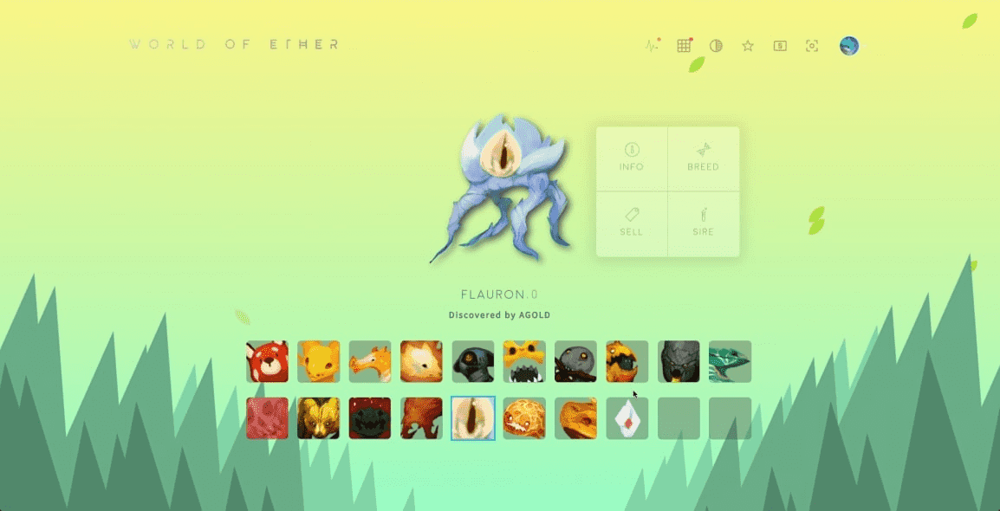

# World of Ether

以太坊区块链上的去中心化收藏决斗游戏。收集、繁殖、战斗。欢迎来到以太世界。

加入我们的密码游戏世界。 5000个怪物将被出售。每个怪物都可以在 PVP 体验中玩。带有独特艺术品的 NFT 销售将开启密码游戏世界。在这个新世界中，我们已经确定了 205 个独特的怪物，每个怪物都有力量和属性。有太阳、海洋、生命、死亡和星光五种类型。每种怪物类型都有 4 种稀有度，普通、罕见、稀有和传奇。我们的科学家发现，稀有的也更强！

