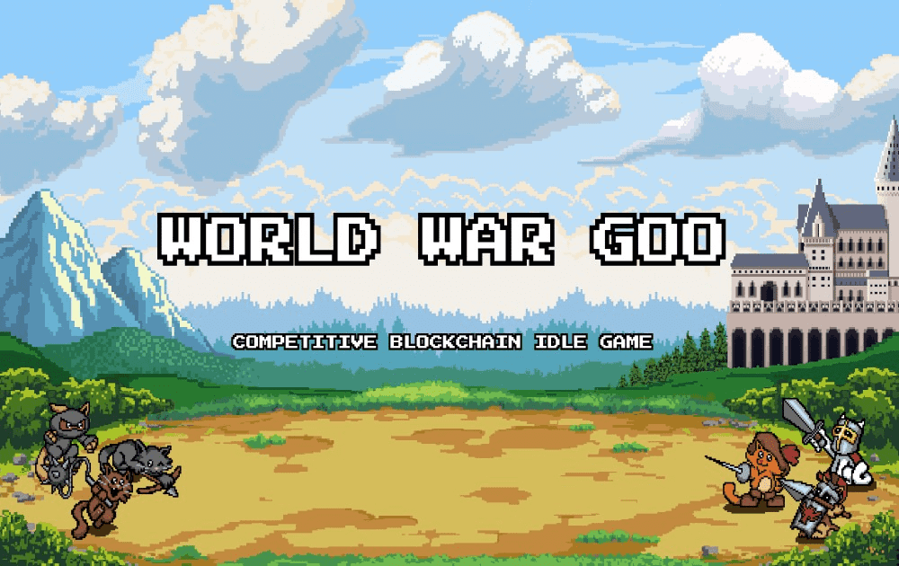

# World War Goo

加密闲置游戏 EtherGoo 的全新竞技续集。加入加密部落，招募单位并为战利品而战！World War Goo，原版EtherGoo的始祖，是一款奇幻放置类游戏，玩家在其中赚取资源、开垦土地和作战军队。玩家可以在氏族中联合起来，获得共享奖励、升级和潜在战利品。

随着玩家开发他们的土地，小猫科学家可以研究新技术，从而在土地上建造更先进的功能，生产更多的 Goo。EtherGoo 是 2018 年 3 月进入区块链游戏领域的较早进入者，并在其闲置游戏中内置了一些复杂的操作。

