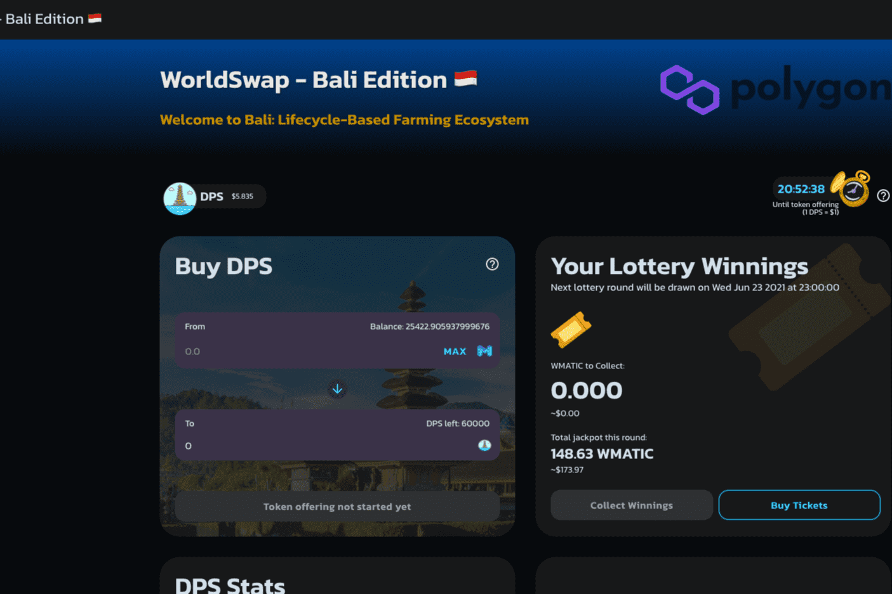

# WorldSwap - BALI Edition

WorldSwap.Finance 是增强型多链单产农业生态系统的核心，其设计和实施考虑了一个简单而强大的理念：提供超高产的独立农场，同时为农民和农民提供一个不断增长的活跃和安全的环境。投资者。
巴厘岛规格：

- 自动流动性和自动燃烧政策
- 动态降低排放率政策
- 多链支持。
- 最大总供应上限约为 115,000 DPS 代币
- 多重审核

大家欢迎来到 WorldSwap！
我们在设计 WORLD 生态系统时考虑了一个简单但非常强大的想法：提供超高收益的独立农场，同时为农民和投资者提供一个不断增长的活跃和安全的环境。

我们的多版本农场（MEF）旨在不断为我们的用户提供高收益的投资工具，同时也让他们在安全可信的环境中享受农场的安心。这是一个非常罕见和独特的组合。

