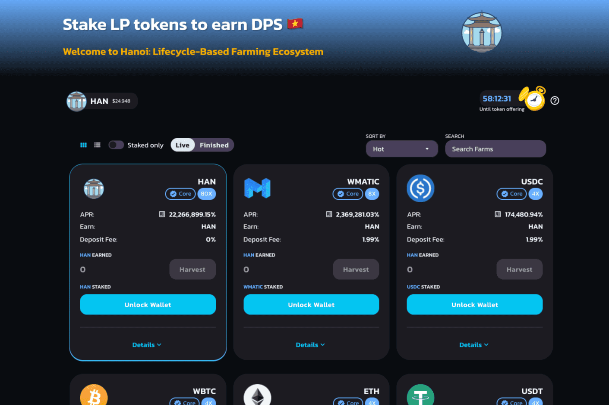

# WorldSwap - HANOI Edition

WorldSwap.Finance 是增强型多链单产农业生态系统的核心，其设计和实施考虑了一个简单而强大的理念：提供超高产的独立农场，同时为农民和农民提供一个不断增长的活跃和安全的环境。投资者。
河内规格：

- 自动刻录政策

- 动态降低排放率政策

- 多链支持。

- 最大总供应上限约为 215,000 HAN 代币

- 多重审查和审计
  新的功能：

- 农场前回购：甚至在农场开始之前回购？是的，100% 保证。

- Early Farmers helper：为了帮助所有早期投资者无论他们的策略如何都能获利，我们将在第一阶段进行大规模回购。

- 超级农场助推器：现在早期农民的排放率提升持续一小时！！

  
