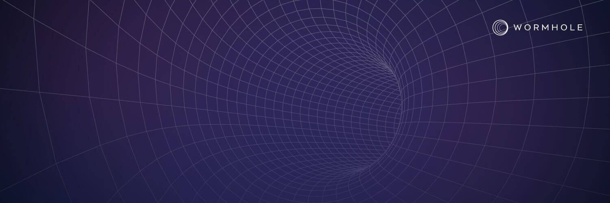

# Wormhole

虫洞网络是一种通用的消息传递协议，将高价值区块链连接在一起，应用程序利用核心消息层来促进生态系统之间的互操作性。在 19 名监护人的保护下，开发人员能够利用该协议跨链发送任意数据，包括代币、NFT、预言机数据、治理决策等。 Wormhole 的最新实现包括 Portal 和 NFT 桥，允许跨受支持的链进行无缝资产转移。目前已连接到 Solana、Terra、Ethereum、Binance Smart Chain、Polygon、Avalanche 和 Oasis，其设计还允许快速共识、易于扩展和可升级的设计以连接更多链，从而使开发人员可以轻松地在 Wormhole 之上构建。

