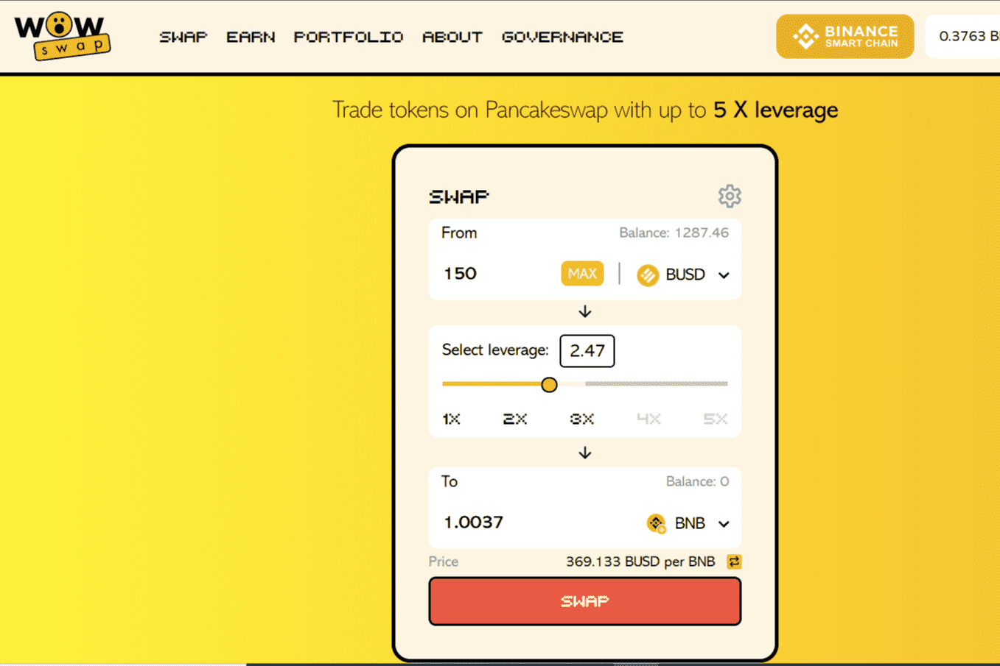

# WOWswap

WOWswap 是一种去中心化杠杆交易协议，运行在以太坊、币安智能链、Solana、Avalanche、IoTeX 和 Polygon Network 上。
交易者可以以高达 5 倍的杠杆买卖他们喜爱的代币。
WOWswap 是一个完全由社区所有的协议，基于一个简单的想法：流动性提供者可以创建一个流动性池，交易者可以借入这些资金购买最多 5 倍的代币。协议费用、贷款人和借款人的利率、清算比率和其他设置由 WOW 代币（我们的治理代币）的持有者决定。
进行 WOW 交换就像在 Uniswap 或 Pancakeswap 上进行常规交换一样简单——额外的资金将自动从流动性池中借入。

