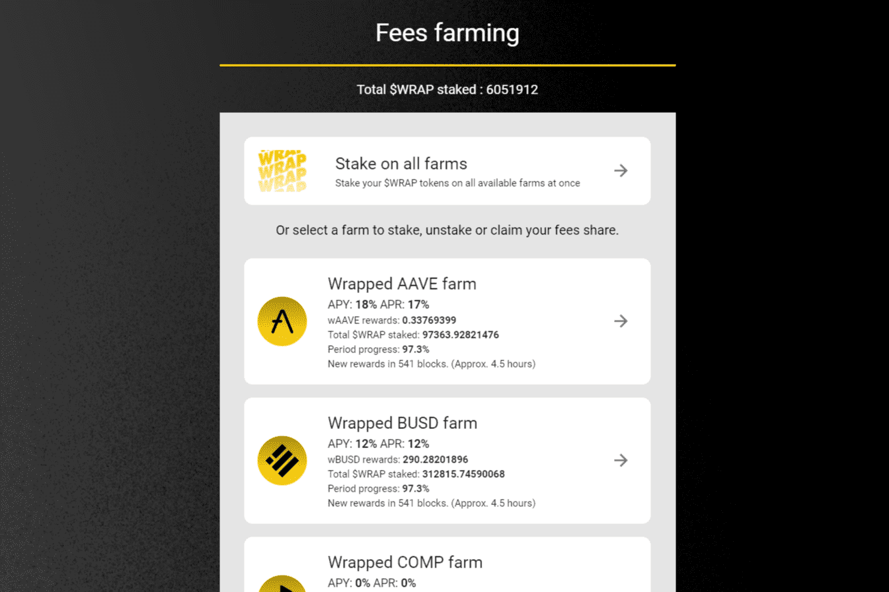

# Wrap Protocol

什么是包装？
通过 Wrap，用户发行 wToken（包装代币），代表 Tezos 区块链上的 ERC20 和 ERC721 代币。然后 wTokens 可以在 Tezos 区块链上使用，它们的价值与原始代币挂钩。 Wrap 是一个去中心化协议，依赖于保证协议稳定性的强大联盟（Signers Quorum）和 WRAP 治理代币持有者社区。

包装协议
什么是 Wrap 协议？
Wrap 协议是以太坊和 Tezos 区块链之间的去中心化桥梁。通过 Wrap 协议，用户可以将他们的以太坊 ERC-20 和 ERC-721 代币以去中心化的方式转移到 Tezos 区块链。

Wrap Protocol 背后的团队是谁？#
Wrap 协议是一个开源项目。 Bender Labs 专注于在公共区块链上构建去中心化金融协议，目前是 Wrap 协议的主要贡献者。

