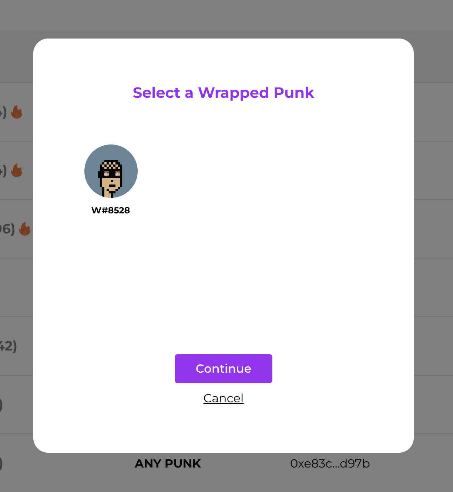

# Wrapped Cryptopunks

Wrapped Punks 可帮助您将原始 Cryptopunks 转换为标准 ERC721，并通过接受赏金或在 Rarible 或 Opensea 等市场上市将您的 Cryptopunks 变成现金。

包裹朋克
将您的 CryptoPunks 变成 ERC721
CryptoPunks 是第一个 NFT。它们由 Larvalabs 于 2017 年年中推出，数量为 10,000 个，并成为 ERC-721 标准的灵感来源之一。它们曾出现在《纽约时报》等地方，
伦敦佳士得....还有更多！
在 larvalabs.com/cryptopunks 购买原版 Cryptopunk

现在朋克可以被包装到 ERC721 中，为朋克所有者开辟了新的可能性：赏金是朝着这个方向迈出的一步。

Gunslinger 是 Twitter 赏金机器人
赏金是对 Punks 的盲注，由 ETH 押金支持。出价可以按特征和属性排序。

基本赏金是对 10.000 个朋克中任何一个的通用出价。
VR 赏金，是对 332 个 VR 朋克中任何一个的通用出价等等……从技术上讲，这可以适用于整个 Cryptopunks 集合的任何特征和任何属性。
如果您是朋克所有者，并且希望立即将其转换为现金，则赏金是存入智能合约的 ETH，等待您的朋克。

从今天开始，如果您想对 Cryptopunk 出价，您需要存入您的出价，并等待所有者接受。如果您正在关注五个朋克，您需要对五个朋克下五个不同的出价。

