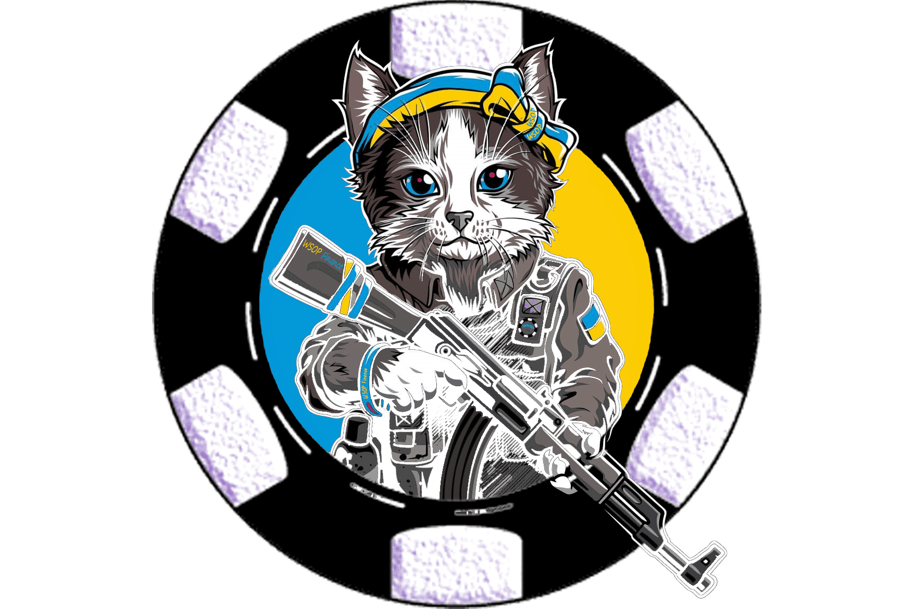

# WSOP Finance

WSOP 是一个项目，我们通过该项目为金融业的未来构建一个全面的、去中心化的交易平台。
WSOP是应用于生态系统的AMM操作系统，通过区块链以P2P和P2C方式独立工作。
WSOP 意味着交易不会匹配其他使用订单的交易。

WSOP是WSOP Token的代币，工作在与其他生态系统联动的币安智能链平台上，独立运作。

WSOP允许在没有中心化中介参与的情况下进行加密货币联合操作；

DEFI：通过更重持续挖矿，增值持有。

NFT：狩猎和补货游戏以增加数量。

ARENA：赢利的竞争环境，对抗东道主和其他人。

